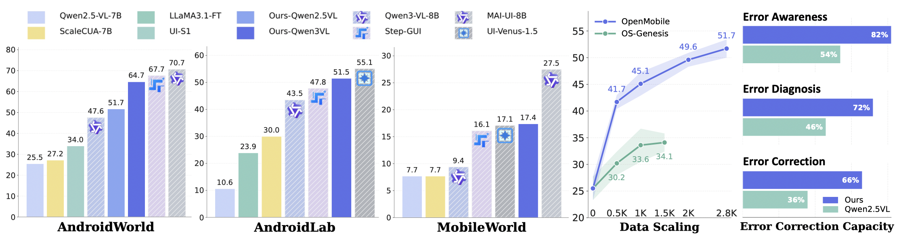

# OpenMobile: Building Open Mobile Agents with Task and Trajectory Synthesis

<p align="center">
&nbsp&nbsp📑 <a href="https://arxiv.org/pdf/2604.15093">Paper</a>&nbsp&nbsp | &nbsp&nbsp🌐 <a href="https://njucckevin.github.io/openmobile/">Homepage</a>&nbsp&nbsp | &nbsp&nbsp🤗 <a href="https://huggingface.co/datasets/cckevinn/OpenMobile-Data">Dataset</a>&nbsp&nbsp | &nbsp&nbsp🤖 <a href="https://huggingface.co/cckevinn/OpenMobile-8B">Model</a>&nbsp&nbsp | &nbsp&nbsp🤗 <a href="https://alankamisslin-mobile-agent-trajectory-viewer.hf.space/">DataViewer</a>&nbsp&nbsp
</p>

Mobile agents powered by vision-language models have demonstrated impressive capabilities in automating mobile tasks, with recent leading models achieving a marked performance leap, e.g., nearly 70\% success on AndroidWorld. However, these systems keep their training data closed and remain opaque about their task and trajectory synthesis recipes. We present **OpenMobile**, an open-source framework that synthesizes high-quality task instructions and agent trajectories, with two key components: (1) The first is a scalable task synthesis pipeline that constructs a global environment memory from exploration, then leverages it to generate diverse and grounded instructions.and (2) a policy-switching strategy for trajectory rollout. By alternating between learner and expert models, it captures essential error-recovery data often missing in standard imitation learning. Agents trained on our data achieve competitive results across three dynamic mobile agent benchmarks: notably, our fine-tuned Qwen2.5-VL and Qwen3-VL reach 51.7\% and **64.7\% on AndroidWorld**, far surpassing existing open-data approaches. Furthermore, we conduct transparent analyses on the overlap between our synthetic instructions and benchmark test sets, and verify that performance gains stem from broad functionality coverage rather than benchmark overfitting.



Release Plans:

- [x] OpenMobile trajectoy data
- [x] Fine-tuned checkpoints based on OpenMobile data
- [x] AndroidWorld evaluation code
- [ ] Task and trajectory synthesis code
- [ ] Other code and resources

## 📋 Table of Contents
- [Project Structure](#project-structure)
- [Environment Setup](#environment-setup)
- [Evaluation](#evaluation)
- [Trajectory Synthesis](#trajectory-synthesis)
- [Training](#training)
- [Acknowledgements](#acknowledgements)
- [License](#license)
- [Citation](#citation)

<a id="project-structure"></a>
## 📂 Project Structure

The repository is organized into two main components.
* `AndroidWorld/` contains the execution-side code, including environment exploration, trajectory rollout, trajectory post-processing, and model evaluation on AndroidWorld.
* `task_synthesis/` contains the task-synthesis pipeline: it takes processed exploration results, builds screen-level context and environment memory, synthesizes the final high-level instructions.

<a id="environment-setup"></a>
## ⚙️ Environment Setup
We recommend using a single conda environment for the full OpenMobile pipeline, including both `AndroidWorld/` and `task_synthesis/`. The detailed setup instructions are documented in [`AndroidWorld/environment.md`](AndroidWorld/environment.md).


<a id="evaluation"></a>
## 📊 Evaluation

Evaluation on AndroidWorld can be run with the following steps.

1. Deploy the target model with vLLM (for example, `OpenMobile-8B`) and obtain `model_base_url` and `model_name`.

2. Start the AndroidWorld emulator / ADB environment:

```bash
EMULATOR_NAME=AndroidWorldAvd
~/Library/Android/sdk/emulator/emulator -avd $EMULATOR_NAME -port 5554 -no-snapshot -grpc 8554
```

For more details about the AndroidWorld environment setup, please also refer to the [official AndroidWorld repository](https://github.com/google-research/android_world).

3. Launch evaluation:

```bash
cd AndroidWorld
python run.py \
  --agent_name qwen3vl \
  --console_port 5554 \
  --grpc_port 8554 \
  --perform_emulator_setup=true \
  --model_base_url your_vllm_url \
  --model_name OpenMobile-8B \
  --model_api_key EMPTY \
  --checkpoint_dir runs/openmobile_8b_seed30 \
  --task_random_seed 30
```

<a id="trajectory-synthesis"></a>
## 🎮 Trajectory Synthesis
Coming soon.

<a id="training"></a>
## 💻 Training
Coming soon.

<a id="acknowledgements"></a>
## 💐 Acknowledgements
Thanks to the following open-sourced projects:

[AndroidWorld](https://github.com/google-research/android_world)&#8194; 
[AndroidLab](https://github.com/THUDM/Android-Lab)&#8194;
[MobileWorld](https://github.com/Tongyi-MAI/MobileWorld)&#8194;
[ScaleCUA](https://github.com/OpenGVLab/ScaleCUA)&#8194; 
[OS-Genesis](https://github.com/OS-Copilot/OS-Genesis) &#8194;
[Qwen-VL](https://github.com/QwenLM/Qwen3-VL) &#8194; 
[LlamaFactory](https://github.com/hiyouga/LlamaFactory) &#8194;

<a id="license"></a>
## ⚖️ License

This project is licensed under the [Apache 2.0 License](https://www.google.com/search?q=LICENSE). Other released artifacts, third-party models, datasets, and derived resources may be subject to their own respective licenses and usage terms.

<a id="citation"></a>
## 📜 Citation

If you find this project useful, please consider citing:

```bibtex
@article{cheng2026openmobile,
  title={OpenMobile: Building Open Mobile Agents with Task and Trajectory Synthesis},
  author={Cheng, Kanzhi and Li, Zehao and Ma, Zheng and Chen, Nuo and Cao, Jialin and Sun, Qiushi and Ding, Zichen and Xu, Fangzhi and Yan, Hang and Chen, Jiajun and others},
  journal={arXiv preprint arXiv:2604.15093},
  year={2026}
}
```


